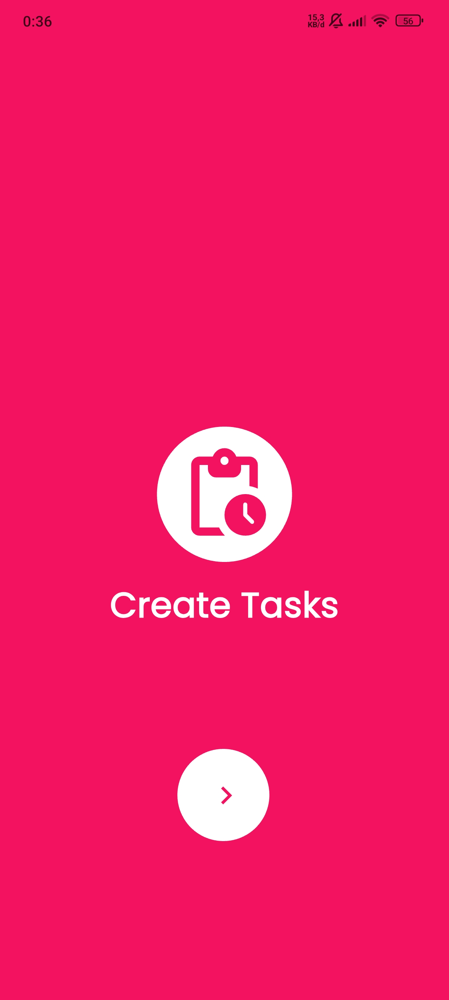
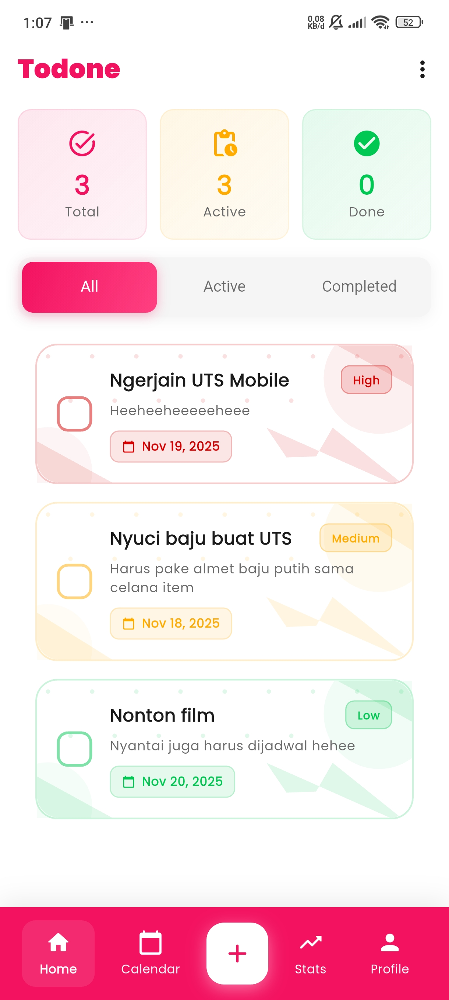

# Todone-App

1. Login Screen
            
       
       

2. Onboarding Screen
            
     

3. Home Screen dan Tambah To-Do List Screen
            
     

Link G-drive : https://drive.google.com/drive/folders/1Cj0XYaP0JoHabBiFvfRd84Dw9M5Tlam4?usp=drive_link
